# Twitter Coverage of AusPreserves
Peter Neish  
`r Sys.time()`  


# Introduction
An analysis of tweets from auspreserves. Code is available on [GitHub](https://github.com/peterneish/auspreserves-tweets).

286
tweets were collected using the `rtweet` R package:


```r
auspreserves <- search_tweets("#auspreserves", 10000)
saveRDS(auspreserves, "data/auspreserves.rds")
```

## Search all the hashtags!
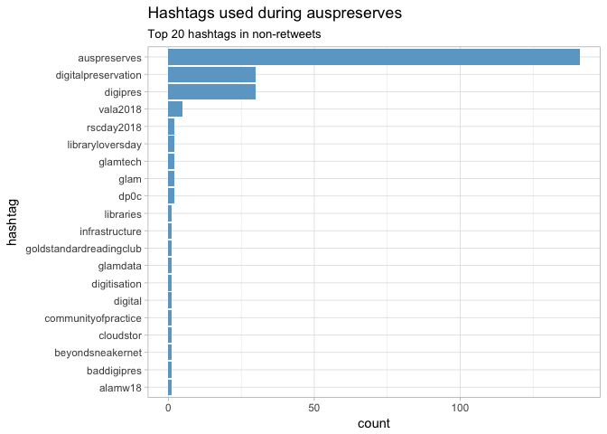<!-- -->

# Timeline
## Tweets by day
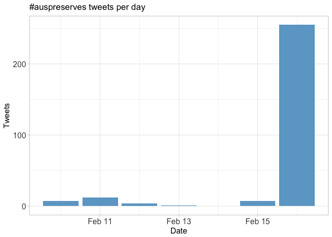<!-- -->

## Tweets by day and time
Filtered for dates August 21-25, Melbourne time.
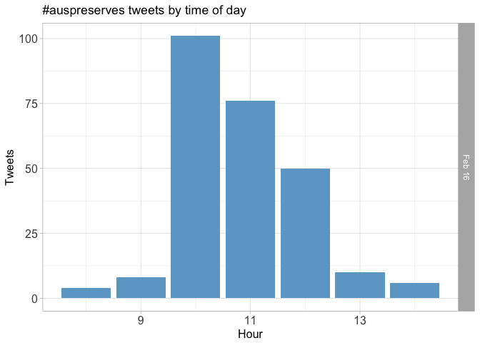<!-- -->

# Users
## Top tweeters
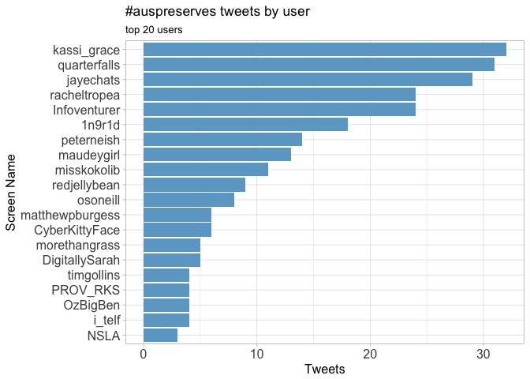<!-- -->

## Sources
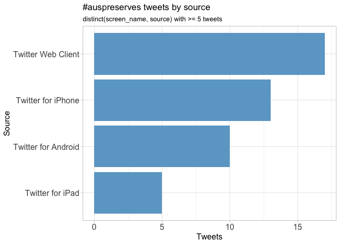<!-- -->

# Networks
## Replies
The "replies network", composed from users who reply directly to one another, 
coloured by page rank.

Click to view image.


 [](data/replies.svg)

## Mentions
The "mentions network", where users mention other users in their tweets.
Filtered for k-core >= 4 and coloured by modularity class.

Click to show image.


[](data/mentions.svg)

# Retweets
## Retweet proportion
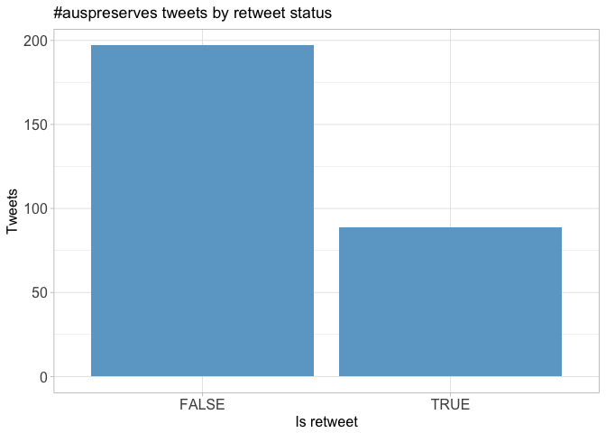<!-- -->

## Retweet count
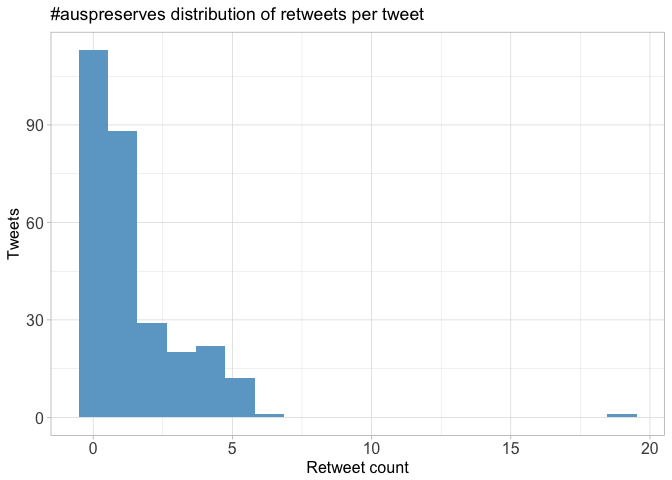<!-- -->

## Top retweets
<table>
 <thead>
  <tr>
   <th style="text-align:left;"> screen_name </th>
   <th style="text-align:left;"> text </th>
   <th style="text-align:right;"> retweet_count </th>
  </tr>
 </thead>
<tbody>
  <tr>
   <td style="text-align:left;"> jayechats </td>
   <td style="text-align:left;"> On Friday 16th Feb 2018 @unimelb is hosting a #digitalpreservation community of practice event, aiming to share exp… https://t.co/gCm4bvIzaH </td>
   <td style="text-align:right;"> 19 </td>
  </tr>
  <tr>
   <td style="text-align:left;"> Infoventurer </td>
   <td style="text-align:left;"> Nice idea to do an Australian Digital Preservation 23 Things (similar to 23 (Research Data) Things… https://t.co/B7nyZ5LOyE </td>
   <td style="text-align:right;"> 6 </td>
  </tr>
  <tr>
   <td style="text-align:left;"> racheltropea </td>
   <td style="text-align:left;"> #AusPreserves #digitalpreservation #digipres @lylewinton does the wrap up. People want to keep meeting and collabor… https://t.co/nE02liIYV8 </td>
   <td style="text-align:right;"> 5 </td>
  </tr>
  <tr>
   <td style="text-align:left;"> jayechats </td>
   <td style="text-align:left;"> Only 5 days until our #AusPreserves event showcasing #digitalpreservation in the Australasian region https://t.co/koHrZuoWcp </td>
   <td style="text-align:right;"> 5 </td>
  </tr>
  <tr>
   <td style="text-align:left;"> peterneish </td>
   <td style="text-align:left;"> Lyle Winton now summarising #auspreserves 1. we should keep doing this 2. the informal sharing is good (no death by… https://t.co/uGo65YodZA </td>
   <td style="text-align:right;"> 4 </td>
  </tr>
  <tr>
   <td style="text-align:left;"> jayechats </td>
   <td style="text-align:left;"> Grand wish: I'd love to see multiple events being run around Australia and New Zealand like the @dpc_chat… https://t.co/lwE9QgJSet </td>
   <td style="text-align:right;"> 4 </td>
  </tr>
  <tr>
   <td style="text-align:left;"> jayechats </td>
   <td style="text-align:left;"> At the end of a jam-packed week of #vala2018 conferencing, stalwart folks are at @unimelb discussing how an Austral… https://t.co/Zata9FFyUD </td>
   <td style="text-align:right;"> 4 </td>
  </tr>
  <tr>
   <td style="text-align:left;"> maudeygirl </td>
   <td style="text-align:left;"> Just heard about this site; https://t.co/kS9F4mn27A parking here for later fun. #AusPreserves </td>
   <td style="text-align:right;"> 4 </td>
  </tr>
  <tr>
   <td style="text-align:left;"> racheltropea </td>
   <td style="text-align:left;"> #AusPreserves #digitalpreservation #digipres @osoneill from @PRO_Vic : talking an open source, modular approach to… https://t.co/XdS7xUBXiw </td>
   <td style="text-align:right;"> 4 </td>
  </tr>
  <tr>
   <td style="text-align:left;"> racheltropea </td>
   <td style="text-align:left;"> #AusPreserves about to begin with speakers @leninoc @jessicammoran Peter McKinney @osoneill Betsy Earl @maudeygirl… https://t.co/9qXMC32M8C </td>
   <td style="text-align:right;"> 4 </td>
  </tr>
</tbody>
</table>

# Favourites
## Favourite proportion
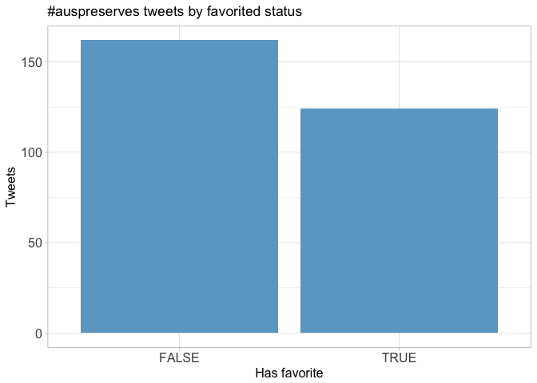<!-- -->

## Favourite count
<!-- -->

## Top favourites
<table>
 <thead>
  <tr>
   <th style="text-align:left;"> screen_name </th>
   <th style="text-align:left;"> text </th>
   <th style="text-align:right;"> favorite_count </th>
  </tr>
 </thead>
<tbody>
  <tr>
   <td style="text-align:left;"> jayechats </td>
   <td style="text-align:left;"> On Friday 16th Feb 2018 @unimelb is hosting a #digitalpreservation community of practice event, aiming to share exp… https://t.co/gCm4bvIzaH </td>
   <td style="text-align:right;"> 26 </td>
  </tr>
  <tr>
   <td style="text-align:left;"> Infoventurer </td>
   <td style="text-align:left;"> Nice idea to do an Australian Digital Preservation 23 Things (similar to 23 (Research Data) Things… https://t.co/B7nyZ5LOyE </td>
   <td style="text-align:right;"> 14 </td>
  </tr>
  <tr>
   <td style="text-align:left;"> jayechats </td>
   <td style="text-align:left;"> Only 5 days until our #AusPreserves event showcasing #digitalpreservation in the Australasian region https://t.co/koHrZuoWcp </td>
   <td style="text-align:right;"> 14 </td>
  </tr>
  <tr>
   <td style="text-align:left;"> suehutley </td>
   <td style="text-align:left;"> This week on twitter speed-dial.... #alamw18 #vala2018 #rscday2018 #libraryloversday #AusPreserves </td>
   <td style="text-align:right;"> 11 </td>
  </tr>
  <tr>
   <td style="text-align:left;"> jayechats </td>
   <td style="text-align:left;"> Great location=✅ Great team=✅ @dpc_chat merch=✅ standing by to get our live link to our New Zealand neighbours up a… https://t.co/wLVyAWcqP5 </td>
   <td style="text-align:right;"> 10 </td>
  </tr>
  <tr>
   <td style="text-align:left;"> jayechats </td>
   <td style="text-align:left;"> Grand wish: I'd love to see multiple events being run around Australia and New Zealand like the @dpc_chat… https://t.co/lwE9QgJSet </td>
   <td style="text-align:right;"> 8 </td>
  </tr>
  <tr>
   <td style="text-align:left;"> maudeygirl </td>
   <td style="text-align:left;"> Listening to @carlsen_c I had a squee moment about getting to do a digital deposit of my research thesis on digitia… https://t.co/74lp1aJxQk </td>
   <td style="text-align:right;"> 6 </td>
  </tr>
  <tr>
   <td style="text-align:left;"> GraLBal </td>
   <td style="text-align:left;"> .@maudeygirl on breaking the misconception that we don’t have to worry about digital preservation because “it all e… https://t.co/a36HbXb9LZ </td>
   <td style="text-align:right;"> 6 </td>
  </tr>
  <tr>
   <td style="text-align:left;"> jayechats </td>
   <td style="text-align:left;"> At the end of a jam-packed week of #vala2018 conferencing, stalwart folks are at @unimelb discussing how an Austral… https://t.co/Zata9FFyUD </td>
   <td style="text-align:right;"> 5 </td>
  </tr>
  <tr>
   <td style="text-align:left;"> kassi_grace </td>
   <td style="text-align:left;"> Hero @maudeygirl has had to deal with dudes “internet elders” and their resistance. Not gonna stop her 💪🏼 #AusPreserves </td>
   <td style="text-align:right;"> 5 </td>
  </tr>
</tbody>
</table>

# Quotes
## Quote proportion
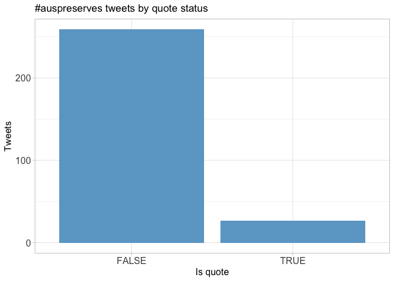<!-- -->

## Quote count
<!-- -->

## Top quotes
<table>
 <thead>
  <tr>
   <th style="text-align:left;"> screen_name </th>
   <th style="text-align:left;"> text </th>
   <th style="text-align:right;"> quote_count </th>
  </tr>
 </thead>
<tbody>
  <tr>
   <td style="text-align:left;"> jayechats </td>
   <td style="text-align:left;"> Only 5 days until our #AusPreserves event showcasing #digitalpreservation in the Australasian region https://t.co/koHrZuoWcp </td>
   <td style="text-align:right;"> 6 </td>
  </tr>
  <tr>
   <td style="text-align:left;"> 1n9r1d </td>
   <td style="text-align:left;"> Ping @ands_nectar_rds @n_simons data capability development gap #digitalpreservation ##AusPreserves https://t.co/09f0eBGR2Y </td>
   <td style="text-align:right;"> 3 </td>
  </tr>
  <tr>
   <td style="text-align:left;"> 1n9r1d </td>
   <td style="text-align:left;"> Retweet for those joining the #AusPreserves conversation today #digitalpreservation #digipres #glamtech https://t.co/JJjng8qpzO </td>
   <td style="text-align:right;"> 2 </td>
  </tr>
  <tr>
   <td style="text-align:left;"> kassi_grace </td>
   <td style="text-align:left;"> An idea for the next #AusPreserves, @jayechats? :P
https://t.co/6rPSQSg2fQ </td>
   <td style="text-align:right;"> 2 </td>
  </tr>
  <tr>
   <td style="text-align:left;"> quarterfalls </td>
   <td style="text-align:left;"> Oops Peter McKinney is at National Library (not Archives) NZ, my mistake. He's now back as himself to discuss the l… https://t.co/z4EOXveyL5 </td>
   <td style="text-align:right;"> 2 </td>
  </tr>
  <tr>
   <td style="text-align:left;"> PROV_RKS </td>
   <td style="text-align:left;"> Some interesting presentations and discussions at #AusPreserves including our own @osoneill on @PRO_Vic's new digit… https://t.co/Cm796GcLcc </td>
   <td style="text-align:right;"> 2 </td>
  </tr>
</tbody>
</table>

# Media
## Media count
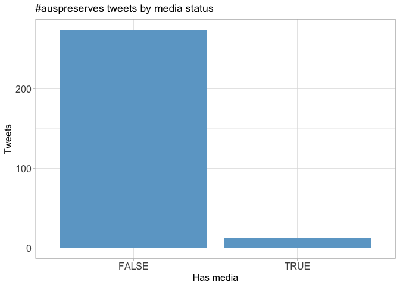<!-- -->

## Top media
<table>
 <thead>
  <tr>
   <th style="text-align:left;"> screen_name </th>
   <th style="text-align:left;"> text </th>
   <th style="text-align:right;"> favorite_count </th>
  </tr>
 </thead>
<tbody>
  <tr>
   <td style="text-align:left;"> aliaQLD </td>
   <td style="text-align:left;"> It's a big week for the #GLAM sector! #rscday2018 #VALA2018 #libraryloversday #AusPreserves via @suehutley https://t.co/NTNZM1j0Ko </td>
   <td style="text-align:right;"> 5 </td>
  </tr>
  <tr>
   <td style="text-align:left;"> i_telf </td>
   <td style="text-align:left;"> All set for #AusPreserves! https://t.co/iloO6QHRfQ </td>
   <td style="text-align:right;"> 4 </td>
  </tr>
  <tr>
   <td style="text-align:left;"> 1n9r1d </td>
   <td style="text-align:left;"> Great crowd at #Auspreserves at @unimelb #digitalpreservation is the focus of the day #digipres #glamtech #glamdata https://t.co/e7cDtEdqeP </td>
   <td style="text-align:right;"> 2 </td>
  </tr>
  <tr>
   <td style="text-align:left;"> CyberKittyFace </td>
   <td style="text-align:left;"> #AusPreserves event has started! #digipres https://t.co/7UKbG7VIfE </td>
   <td style="text-align:right;"> 2 </td>
  </tr>
  <tr>
   <td style="text-align:left;"> racheltropea </td>
   <td style="text-align:left;"> #AusPreserves #digitalpreservation #digipres @bhoughton from @Deakin talks strategy https://t.co/p6AcCXH8RO </td>
   <td style="text-align:right;"> 1 </td>
  </tr>
  <tr>
   <td style="text-align:left;"> CyberKittyFace </td>
   <td style="text-align:left;"> Hearing from @jessicammoran about @NLNZ  approach to #digipres #AusPreserves https://t.co/NmX0xt2n8M </td>
   <td style="text-align:right;"> 1 </td>
  </tr>
</tbody>
</table>

### Most liked media images


# Tweet text
The 100 words used 3 or more times.

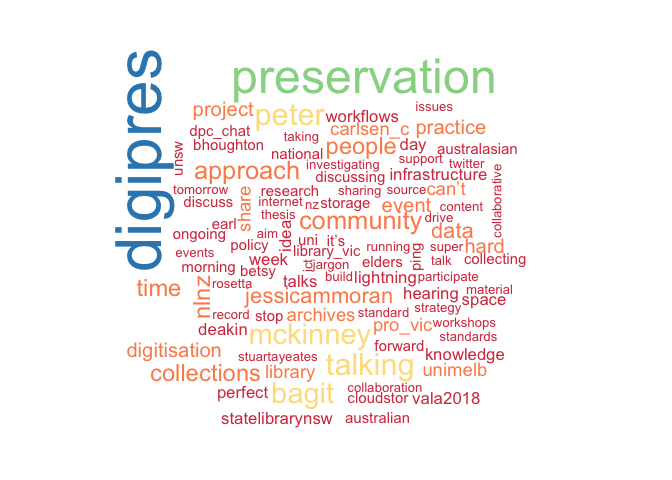<!-- -->
